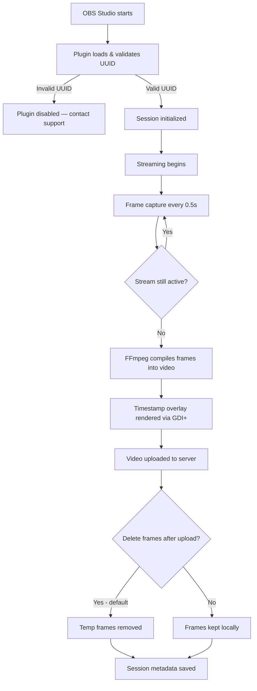

# OBS Time-Lapse Plugin - Releases

Official releases and installer for the BetterWebcam OBS Time-Lapse Plugin.

## Download

### Installer (Recommended)
Download the latest installer that handles everything automatically:

**[Download OBS-TimeLapse-Installer.exe](https://github.com/jgomez696/obs-timelapse-releases/releases/latest/download/OBS-TimeLapse-Installer.exe)**

### Manual Installation
If you prefer manual installation, download the DLL directly:

1. Download `obs-timelapse.dll` from [Releases](https://github.com/jgomez696/obs-timelapse-releases/releases)
2. Copy to `C:\Program Files\obs-studio\obs-plugins\64bit\`
3. Restart OBS Studio

## Features

- Automatic timelapse video generation during streaming
- Multi-platform support (Chaturbate, Streamate, etc.)
- Automatic video upload to server
- Session metadata tracking
- FFmpeg integration for high-quality video

## How It Works

This plugin integrates silently into OBS Studio and automates the full timelapse lifecycle — from frame capture during a live session to video compilation and server upload — without interrupting your stream.



### Step-by-Step Workflow

#### 1. Plugin Load & Authentication
When OBS starts, the plugin performs a UUID validation request against the BetterWebcam backend API.

- The UUID is configured once during installation (the installer handles this automatically).
- If validation fails, the plugin disables itself and logs the reason to OBS's log file (`%APPDATA%\obs-studio\logs\`).

#### 2. Session Initialization
Once authenticated, the plugin registers itself as an OBS source and prepares a temporary working directory for the current session.

- Session metadata (start time, platform, stream ID) is tracked in memory.
- A unique session identifier is generated per stream.

#### 3. Frame Capture During Stream
While the stream is active, the plugin captures frames from the OBS output at a configurable interval.

| Parameter | Default | Notes |
|---|---|---|
| Capture interval | `0.5 seconds` | Configurable in plugin settings |
| Frame format | PNG | Lossless, processed by FFmpeg later |
| Temp storage | Local disk | Cleaned up after compilation by default |

Frames are saved to a temporary directory and named sequentially for deterministic FFmpeg ordering.

#### 4. Video Compilation (FFmpeg)
When the stream ends, the plugin invokes FFmpeg (bundled with OBS) to compile the captured frames into a timelapse video.

```bash
# Internal command (for reference — executed automatically by the plugin)
ffmpeg -framerate 30 -i frame_%06d.png -c:v libx264 -prf yuv420p timelapse_output.mp4
```

- A **GDI+ timestamp overlay** is rendered onto the video indicating the session date/time.
- Output quality is optimized for upload size vs. visual fidelity.

#### 5. Automatic Server Upload
The compiled video is uploaded automatically to the BetterWebcam server along with session metadata.

- Upload happens in the background — you can start a new stream immediately.
- If the upload fails, it retries on the next OBS session start.
- Failed uploads are queued locally and logged.

#### 6. Cleanup
By default, temporary frame files are deleted after successful compilation to conserve disk space. This behavior is **enabled by default** since v0.6.6.

### Common Issues & Solutions

| Issue | Likely Cause | Solution |
|---|---|---|
| Plugin not visible in OBS | DLL in wrong folder | Ensure `obs-timelapse.dll` is in `obs-plugins\64bit\` |
| UUID validation error | Invalid or expired UUID | Contact support for a new UUID |
| No video generated | FFmpeg not found | Reinstall OBS Studio (includes FFmpeg) |
| Upload fails silently | No internet / server error | Check OBS log at `%APPDATA%\obs-studio\logs\` |
| Large disk usage | Frame cleanup disabled | Re-enable "Delete frames after compilation" in settings |

### Log File Location

```
%APPDATA%\obs-studio\logs\
```

Open from OBS: **Help → Log Files → View Current Log**

## Requirements

- Windows 10 or later
- OBS Studio 28.0 or later
- FFmpeg (included with OBS)

## Version History

### v0.6.0 (February 2026)
- UUID validation with backend API
- Improved GDI+ timestamp rendering
- Better session management
- Debug logging improvements

### v0.5.0 (January 2026)
- Initial public release
- Basic timelapse capture
- Server upload support

## Support

For issues or feature requests, please contact support.

## License

Proprietary - BetterWebcam

---

*This repository contains only release binaries. Source code is maintained privately.*